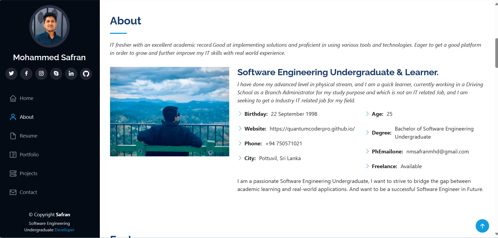

<h1 align="center">Hi 👋, I'm Safran</h1>
<!-- 

  -->

<h3 align="center">Software Engineering Undergraduate 💻❤️</h3>
 

    

<!--  -->

- 📘 I'm a third year student pursuing a Bachelor of Software Engineering at **Open University of Sri Lanka**.
- 💻 I'm currently working on **Full-Stack Development**.
- 😍 I'm looking to **collaborate with other developers for knowledge sharing**.
- 🎯 2023 Goals: **Contribute more to innovative tech projects**.
- ☁️ I'm willing to expand my knowledge in **Web Development, Cloud Technologies, DevOps Practices and Quality Assurance**.
- 🌱 I’m currently learning **MERN Stack**
- 🤹 Fun fact: I mostly like to apply my knowledge to **real-life projects**.
- ☕ **Coffeeholic** & **Music Lover**.
- 📫 How to reach me: **nmsafranmhd@gmail.com**
- 😎 Portfolio: [**nm-safran.github.io**](https://nm-safran.github.io/)
- 📄 Know about my experiences [here](https://drive.google.com/file/d/1XY5C-5DRVM6Ep2OTkT8Z0YRL4aV4Y0ZQ/view?usp=sharing)

  

  

## 💻 Technologies & Tools:
                      

### Blogs posts
<!-- Add your blog posts here -->

## 🎯 Let's Keep in Touch:

  

<h3 align="left">Connect with me:</h3>

  

  

  

  

<h3 align="left">Support:</h3>

  

<!-- Badges Markdown - https://github.com/Ileriayo/markdown-badges -->
