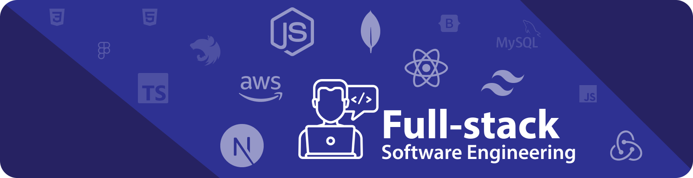
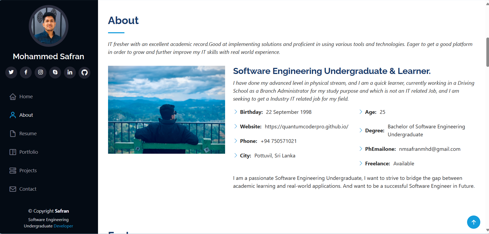

<div align="center">

<!-- Animated gradient header banner -->


<!-- Typing animation -->
<a href="https://git.io/typing-svg">
  
</a>

<br/>

<!-- Badge row -->


<br/><br/>


</div>

<br/>

<table align="center">
<tr>
<td width="58%" valign="top">

### 🚀 About Me

```yaml
name: Safran Mohamed
role: Software Engineer
education: BSc (Hons) Software Engineering — Open University of Sri Lanka
currently_building: Full-Stack Web Applications
currently learning: AI, ML, Cloud & DevOps
collaboration: Open to knowledge-sharing with fellow devs
goal_2025: Contribute more to innovative tech projects
fun_fact: I love turning ideas into real-life projects
fuel: ☕ Coffee + 🎧 Music
```

📫 **Email:** nmsafranmhd@gmail.com
😎 **Portfolio:** [nm-safran.github.io](https://nm-safran.github.io/)
📄 **Resume:** [View here](https://drive.google.com/file/d/1XY5C-5DRVM6Ep2OTkT8Z0YRL4aV4Y0ZQ/view?usp=sharing)

</td>
<td width="42%" align="center">



<br/><br/>

<a href="https://nm-safran.github.io/">
  
</a>

<br/><br/>


</td>
</tr>
</table>

<div align="center">


</div>

<div align="center">

## 🛠️ Tech Arsenal

</div>

<div align="center">


<br/><br/>


</div>

<br/>

<div align="center">

## 📊 GitHub Analytics


### 🏆 Trophy Case


### 📈 Activity Graph


</div>

<div align="center">

## 💬 Random Dev Quote


</div>

<div align="center">


</div>

<div align="center">

## 🎯 Let's Connect

<a href="https://dev.to/safrancoderpro" target="_blank"></a>
<a href="https://www.linkedin.com/in/safranmhd/" target="_blank"></a>
<a href="https://stackoverflow.com/users/22982922/safran" target="_blank"></a>
<a href="https://www.instagram.com/safranaf" target="_blank"></a>
<a href="https://www.behance.net/safranmohammed" target="_blank"></a>
<a href="https://hashnode.com/@safran" target="_blank"></a>
<a href="https://medium.com/@nmsafranmhd" target="_blank"></a>
<a href="https://www.youtube.com/@digital-life9899" target="_blank"></a>
<a href="https://web.facebook.com/safran%20mas" target="_blank"></a>

<br/><br/>

<a href="https://www.buymeacoffee.com/safran">
  
</a>

<br/><br/>


<i>Thanks for stopping by — let's build something great together! ✨</i>

</div>
